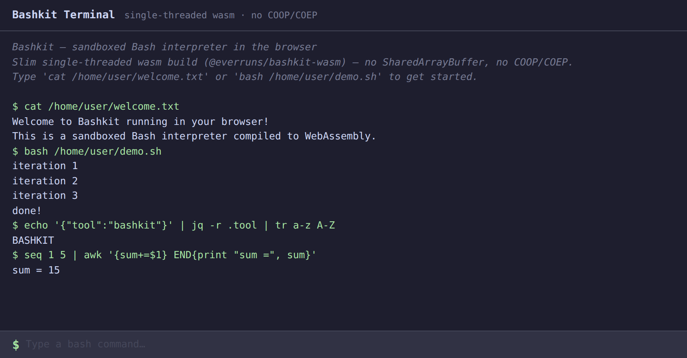

# Bashkit Browser Example

A sandboxed Bash interpreter running entirely in the browser via WebAssembly.



## Quick Start

```bash
pnpm install --frozen-lockfile
pnpm start
```

Open http://localhost:5173. No Rust toolchain, no build step, pnpm verifies and
installs the lockfile-pinned prebuilt wasm package.

## How It Works

The example depends on [`@everruns/bashkit-wasm`](https://www.npmjs.com/package/@everruns/bashkit-wasm),
a slim, **single-threaded** WebAssembly build (`wasm32-unknown-unknown` via
`wasm-bindgen`). It ships the compiled `.wasm` in the npm package, so there is
nothing to compile locally.

Because it is single-threaded, it needs **no `SharedArrayBuffer` and no
cross-origin isolation**: there are no `COOP`/`COEP` headers in
`vite.config.js`, and it drops into any static host or bundler (including
embedded / third-party iframe contexts where those headers cannot be set).

The terminal UI is a single `index.html`, no framework. The `browserLocal`
storage backend snapshots files under `/home/user` to `localStorage` after each
command and restores them on the next page load.

## Feature Surface

Present: full bash syntax, the text-tool builtins (`grep`, `sed`, `awk`, `find`,
`jq`, …), a virtual filesystem, resource limits, and JS custom builtins.

Absent (need sockets, threads, or a host FS the browser sandbox lacks):
`http_client` (`curl`/`wget`), `ssh`, `sqlite`, embedded `python`, `realfs`
mounts. Reach the network from a custom builtin that calls the app's own
`fetch`. See `crates/bashkit-wasm/` and `knowledge/runtimes/browser-package.md` for details.

## Scripts

| Command | Description |
|---------|-------------|
| `pnpm start` / `pnpm dev` | Start the Vite dev server |
| `pnpm run build` | Production bundle |
| `pnpm run preview` | Preview the production bundle |
| `pnpm test` | Test the `browserLocal` storage backend |

## Requirements

- Node.js >= 18
- A modern browser (WebAssembly + ES modules)
